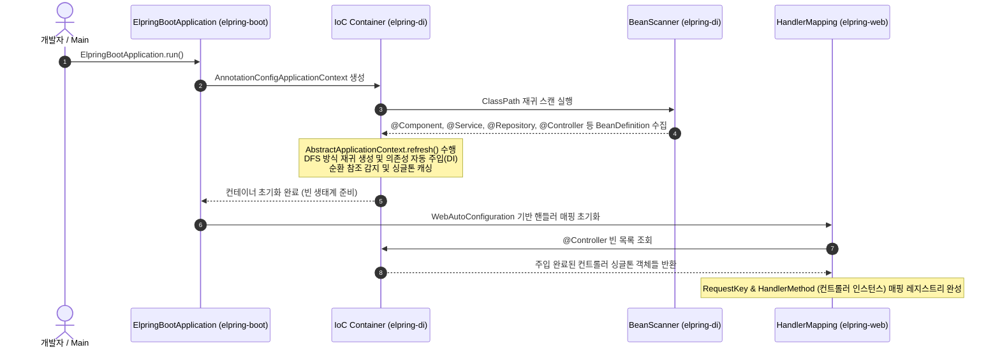
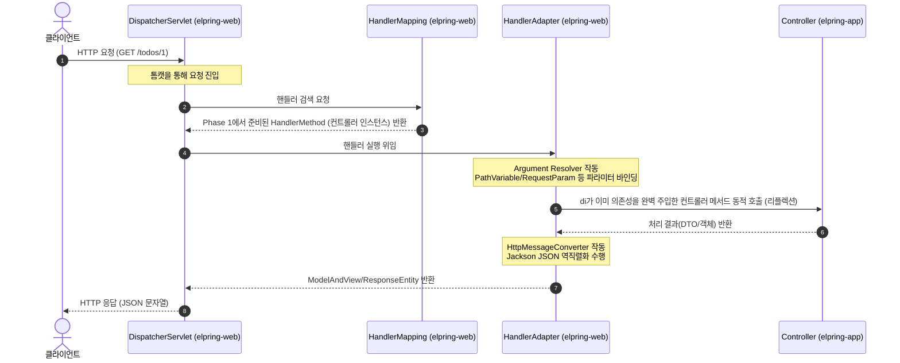

# Elpring Framework

| elpring-di (DI) | elpring-web (Web) | elpring-boot (Boot) |
| :---: | :---: | :---: |
| [](https://jitpack.io/#eello/elpring-di) | [](https://jitpack.io/#eello/elpring-web) | [](https://jitpack.io/#eello/elpring-boot) |

`Elpring Framework`는 Spring Boot, Spring MVC, 그리고 IoC/DI 컨테이너의 내부 동작 메커니즘을 깊이 있게 이해하고 직접 학습하기 위해 순수 Java 환경에서 개발된 경량 커스텀 웹 프레임워크 생태계입니다.

본 저장소는 독자적으로 배포 및 작동 가능한 라이브러리들을 **Git Submodule**을 활용해 하나의 통합 프로젝트 환경으로 구축한 모노레포 형태의 상위 프로젝트입니다.

---

## 📂 서브모듈 구성 및 역할

본 프레임워크는 유기적으로 결합된 4개의 하위 프로젝트로 세분화되어 관리됩니다.

| 모듈명 | 성격 | 주요 역할 및 기능 |
| :--- | :--- | :--- |
| **[elpring-di](file:///Users/jongseong/01.%20Projects/elpring-framework/elpring-di)** | 라이브러리 | ClassPath 스캔, 리플렉션(Reflection) 및 재귀 스캔 기반의 IoC/DI 컨테이너 엔진 |
| **[elpring-web](file:///Users/jongseong/01.%20Projects/elpring-framework/elpring-web)** | 라이브러리 | DispatcherServlet 중심의 프론트 컨트롤러 패턴 및 웹 요청 파라미터 매핑 엔진 |
| **[elpring-boot](file:///Users/jongseong/01.%20Projects/elpring-framework/elpring-boot)** | 프레임워크 | 내장 아파치 톰캣 구동 및 자동 설정(Auto Configuration) 지원 부트스트랩 |
| **[elpring-app](file:///Users/jongseong/01.%20Projects/elpring-framework/elpring-app)** | 애플리케이션 | Elpring 프레임워크 전체를 활용해 구현된 Todo REST API 구체적 예제 앱 |

---

## 🔄 프레임워크 전체 아키텍처 및 흐름

Elpring Framework는 **애플리케이션 구동 및 DI 컨테이너 초기화 단계(Phase 1)**와 **HTTP 요청 처리 런타임 단계(Phase 2)**로 명확히 분리되어 스프링의 핵심 라이프사이클을 고스란히 재현합니다.

### 🌟 Phase 1. 서버 구동 및 DI 컨테이너 초기화 (elpring-di 중심)

`elpring-di` 컨테이너가 애플리케이션 시작 시점에 컴포넌트를 스캔하고 의존 관계를 자동 조립하여 싱글톤 생태계를 구축하는 핵심 과정입니다.



### ⚡ Phase 2. HTTP 요청 처리 런타임 (elpring-web & app 중심)

클라이언트의 요청이 들어왔을 때 Phase 1에서 이미 의존성 주입이 완료된 컨트롤러 인스턴스를 통해 파라미터 바인딩 및 응답을 처리하는 런타임 흐름입니다.



---

## 🚀 시작하기 (Getting Started)

> 💡 **프로젝트 활용 안내**
> * **통합 저장소(`elpring-framework`)**: 전체 프레임워크의 소스 코드 및 각 모듈 간 상호작용을 한곳에서 둘러보고 학습하기 위한 모아보기용 저장소입니다.
> * **실제 프로젝트 사용 시**: 본 프레임워크를 활용해 애플리케이션을 직접 개발하고자 하시는 경우, 이 통합 레포지토리 전체를 클론받을 필요 없이 **`elpring-boot` 의존성 하나만 프로젝트에 추가**하시면 모든 웹/DI 기능(`elpring-web`, `elpring-di`)을 곧바로 사용하실 수 있습니다.

### 1. 실제 애플리케이션 개발 시 (elpring-boot 단독 사용)

자신의 프로젝트 `build.gradle`에 JitPack 저장소와 `elpring-boot` 의존성을 추가합니다.

```groovy
repositories {
    mavenCentral()
    maven { url 'https://jitpack.io' }
}

dependencies {
    // elpring-boot 하나만 추가하면 elpring-di, elpring-web이 자동 포함됩니다.
    implementation 'com.github.eello:elpring-boot:v1.0.0'
}

// ⚠️ 필수 컴파일 옵션: 파라미터 이름 바이트코드 보존
tasks.withType(JavaCompile).configureEach {
    options.compilerArgs << "-parameters"
}
```

### 2. 전체 소스 코드 탐색 및 학습 시 (통합 레포 클론)

전체 모듈의 소스 코드를 한꺼번에 둘러보고자 하실 때는 서브모듈 옵션(`--recursive`)을 포함하여 통합 저장소를 클론합니다.

```bash
git clone --recursive https://github.com/eello/elpring-framework.git
```

이미 옵션 없이 클론을 받았다면, 프로젝트 루트 디렉토리에서 아래 명령어로 서브모듈을 초기화하고 동기화할 수 있습니다.

```bash
git submodule update --init --recursive
```

---

## 🛠 로컬 개발 및 의존성 관계

로컬 개발 환경에서는 상위 레포지토리 내의 프로젝트들이 서로를 참조할 때, Gradle의 **Composite Build** 및 **의존성 대체(Dependency Substitution)** 설정을 통해 원격 JitPack 빌드가 아닌 로컬 폴더의 소스 코드를 실시간으로 컴파일하여 상호 작용하도록 세팅되어 있습니다.

의존성 구조 및 개발 환경 설정에 대한 상세 사항은 개별 서브모듈의 `README.md`를 참고해 주세요.
